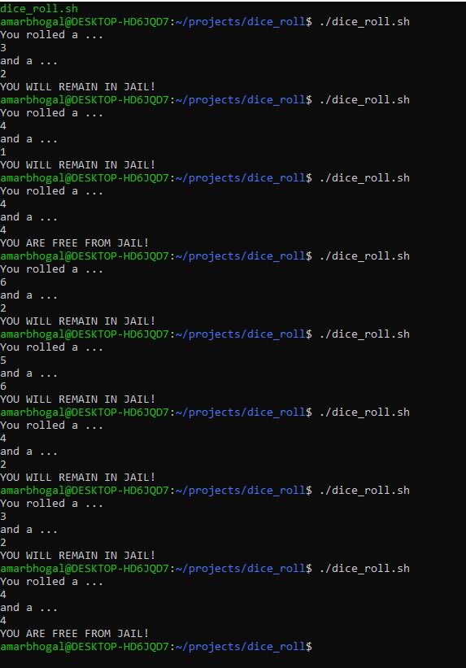

# monopoly-dice-roll
My first bash script. Double dice roll from a Monopoly Jail.

I created a monopoly double dice roll to determine the outcome if a player was stuck in jail on their turn. This simulates the process and determines the outcome of the roll.
Lets see if you can make it out of jail. Good luck!

